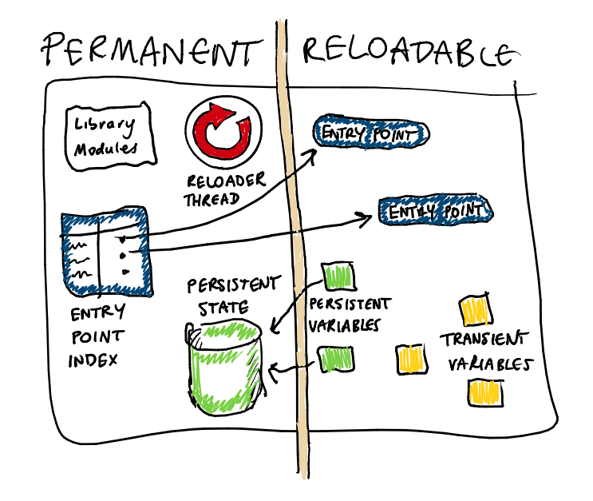

# Code-reloading for Racket



Racket's built-in `dynamic-rerequire` does the heavy lifting, but
doesn't give a high-level interface to help us build reloadable
servers. This package fills in that gap.

### Example

A complete example of a website written using the
[Racket web-server](http://docs.racket-lang.org/web-server/) is
available at <https://github.com/tonyg/racket-reloadable-example>. The
site uses this module to support runtime code-reloading.

 - [`main.rkt`](https://github.com/tonyg/racket-reloadable-example/blob/master/src/main.rkt)
   is the permanent part of the server
 - [`site.rkt`](https://github.com/tonyg/racket-reloadable-example/blob/master/src/main.rkt)
   is the reloadable part of the server

## Usage

1. Split your server into a *permanent* and a *reloadable* part
2. Decide which pieces of state in the reloadable part should be *persistent*
3. Use indirection to access the reloadable part from the permanent part
4. Decide how and when to reload code

### Splitting the server

It's easiest to make the permanent part of your program as small as
possible. This is because if a module is `require`d by the permanent
part of your program, directly or indirectly, then it will *never* be
reloaded, even if it is also `require`d by the reloadable part.

Any modules `require`d from the permanent part of your program are
effectively included in the permanent part of the program.

For example, say your program is started from `main.rkt`, which will
be the permanent part of the application, with the bulk of the program
functionality in the reloadable part, `features.rkt`. Then your
`main.rkt` should be something along the lines of the following:

```racket
#lang racket
(require reloadable)
(define main (reloadable-entry-point->procedure
              (make-reloadable-entry-point 'start-program "features.rkt")))
(reload!)
(main)
```

where `start-program` is `provide`d from `features.rkt`. It is
important that we do not require `features.rkt` from `main.rkt`!
Instead, that is taken care of by the entry-point machinery in this
package.

You must call `reload!` at least once before accessing a new
entry-point's value.

You must also ensure that there are no stray `.zo` files for the
reloadable part of your program. If any such `.zo` files exist, they
will interfere with code loading.

### Persistent state

Your `features.rkt` module may have global variables. Some of these
should be initialised every time the module is reloaded, but others
should only be initialised once, at server startup time.

Global variables that should be reinitialised on every code reload do
not need to be declared differently:

```racket
(define module-variable-initialised-every-time
  (begin (printf "Reinitialising module-variable-initialised-every-time!\n")
         17))
```

Global variables that should be initialised only *once*, at server
startup, should be declared using `make-persistent-state`:

```racket
(define some-persistent-variable
  (make-persistent-state 'some-persistent-variable
                         (lambda ()
                           (printf "Initialising some-persistent-variable!\n")
                           42)))
```

Note that the first argument to `make-persistent-state` must be unique
across the entire Racket instance. This is arguably a bug: ideally,
it'd only need to be unique to a particular module. A future version
of this library may fix this.

Read and write persistent state values like you would parameters:

```racket
;; Access it
(printf "Current some-persistent-variable value: ~a"
        (some-persistent-variable))
;; Set it to a new value
(some-persistent-variable (compute-new-value))
```

### Use `#:prefab` structs for persistent state

Make sure you use
[`#:prefab` structs](http://docs.racket-lang.org/guide/define-struct.html?q=prefab#%28part._prefab-struct%29)
for your persistent state:

```racket
(struct my-state-vector (field1 field2) #:prefab)
```

If you use *non*-prefab structs for persistent state, any newly-loaded
code won't be able to recognise structs that were created by previous
versions of the code.

The reason for this is that non-prefab structs in Racket are
*generative*, meaning that each time your code is reloaded, a new set
of struct types are created.

This transcript shows the problem:

	Welcome to Racket v6.1.1.4.
	-> (struct x () #:transparent)
	-> (define x1 (x))
	-> (struct x () #:transparent)
	-> (define x2 (x))
	-> (x? x2)
	#t
	-> (x? x1)
	#f
	-> (equal? x1 x2)
	#f

With
[prefab structs](http://docs.racket-lang.org/guide/define-struct.html?q=prefab#%28part._prefab-struct%29),
however, the problem goes away:

	Welcome to Racket v6.1.1.4.
	-> (struct x () #:prefab)
	-> (define x1 (x))
	-> (struct x () #:prefab)
	-> (define x2 (x))
	-> (x? x2)
	#t
	-> (x? x1)
	#t
	-> (equal? x1 x2)
	#t

Struct definitions from the permanent part of your program will never
be reloaded, of course, so this warning doesn't apply to them. Pre-
and post-reload routines share the same struct definition in that
case. Likewise, struct definitions whose instances never survive
across a code-reloading (i.e. that are never placed in the program's
persistent state) can be non-prefab.

### Accessing reloadable code from permanent code

Use the entry points you create with `make-reloadable-entry-point`
(which you may also retrieve after they are created by calling
`lookup-reloadable-entry-point`).

Each time `reload!` is called, the `reloadable-entry-point-value` of
each entry point is recomputed from the new versions of each module.

  - If an entry point holds a procedure, you can
	- extract its value and call it directly, or
	- use `reloadable-entry-point->procedure` to convert an entry-point
	  into a general procedure that reflects the calling conventions of
	  the underlying procedure.

  - If an entry point holds any other kind of value, you can use
    `reloadable-entry-point-value` to access it.

### Controlling code reloading

Direct calls to `reload!` force immediate reloading of any changed
code, subject to the caveats about the split between the permanent and
reloadable parts of your program given above.

In addition, by default, the reloadable part of your program is
scanned constantly for changes, and whenever the system notices that a
`.rkt` file in the reloadable part of your program has changed, it
will automatically be recompiled and reloaded.

To disable this automatic scanning, call

```racket
(set-reload-poll-interval! #f)
```

If automatic scanning is disabled, then calls to `reload!` will be the
only way to make code reloading happen.

### Reload hooks

You can use `add-reload-hook!` and `remove-reload-hook!` to install or
remove a "reload hook", a procedure to be called every time a reload
completes, if that reload actually loaded any new or changed code. Each
hook procedure is called with a dictionary mapping a module path to a list
of reloaded source file paths.

## Copyright and License

Copyright &copy; 2014 Tony Garnock-Jones

    This program is free software: you can redistribute it and/or modify
    it under the terms of the GNU Lesser General Public License as published by
    the Free Software Foundation, either version 3 of the License, or
    (at your option) any later version.

    This program is distributed in the hope that it will be useful,
    but WITHOUT ANY WARRANTY; without even the implied warranty of
    MERCHANTABILITY or FITNESS FOR A PARTICULAR PURPOSE.  See the
    GNU Lesser General Public License for more details.

    You should have received a copy of the GNU Lesser General Public License
    along with this program.  If not, see <http://www.gnu.org/licenses/>.
